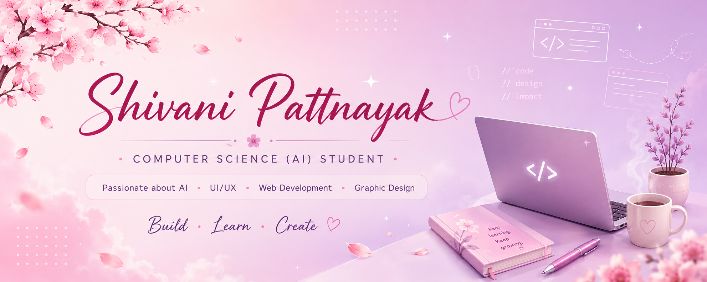

<!--
**Shivani-200610/Shivani-200610** is a ✨ _special_ ✨ repository because its `README.md` (this file) appears on your GitHub profile.

Here are some ideas to get you started:

- 🔭 I’m currently working on ...
- 🌱 I’m currently learning ...
- 👯 I’m looking to collaborate on ...
- 🤔 I’m looking for help with ...
- 💬 Ask me about ...
- 📫 How to reach me: ...
- 😄 Pronouns: ...
- ⚡ Fun fact: ...
-->

  

<h1 align="center">Hi there, I'm Shivani 👋</h1>

<h3 align="center">
Computer Science (AI) Student • Curious Learner • Creative Builder 🌸
</h3>

Passionate about AI, UI/UX Design, Web Development, and building projects that make an impact.

## 🌸 About Me

🎓 I'm a Computer Science (AI) student at **Amrita Vishwa Vidyapeetham, Bengaluru**.

💡 I'm passionate about combining technology and creativity to build meaningful applications.

🤖 Currently exploring **Artificial Intelligence**, **Machine Learning**, **UI/UX Design**, **Web Development**, and **Graphic Design**.

🐍 I'm strengthening my **Data Structures & Algorithms** skills in Python while continuously building new projects.

✨ I believe every project is an opportunity to learn, improve, and create something meaningful.
## 💻 Tech Stack

### 👨‍💻 Languages

  

### 🎨 Design & Tools

  

### 🌱 Currently Learning

- 🐍 Data Structures & Algorithms in Python
- 🤖 Artificial Intelligence & Machine Learning
- 🎨 UI/UX Design
- 🌐 Modern Web Development
